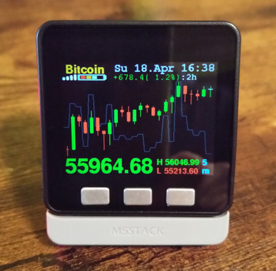

CRYPTO CURRENCY PRICE TICKER with 24 candlesticks chart for M5Stack

###SD-Card Version with configuation file###
only needs config file "ccticker.cfg" on root of SD-Card

receiving WiFi data from Binance API/Websocket_v3 - by frittna (https://github.com/frittna/Crypto_Coin_Ticker)

This will show 24 candles, the min/max price and the volume as line, date and time are from time.nist.gov timeserver.
For M5-Stack MCU , coded in ArduinoIDE 1.8.13 - last modified Nov.19.2021 12:07 CET - Version 1.0.53 using spiffs + SDconfig

LAST EDIT:
added cycling function (ButtonA+ButtonC together) which steps through your currencies after a certain time (default: 15sec for each)

added Timezone for Singapore (UTC+8)

minor changings: code merged to one version, so there is no need to have different versions anymore

autodetect the optional room sensor and show a 12x high sensor panel in case

temperature unit C or F and offset is set from SD-Config and not hardcoded anymore 
(because the M5-Stack is heating up itself it will never be accurate and has only limited expressiveness)

 do not forget to update your sdconfig.cfg on SD-card too
                 
             
 

 ----------------------------------------------------------------------------------------------------------------------------

#Using the App:

###############

This version needs a SD-Card whith the your WiFi credentials, favourite coinpairs, timezone and language(eng/ger/esp) in a textfile - see installation

ButtonA: switches through your favourite Coinpair (as many you want) e.g: BTC/USDT etc. which are available on Binance.com

ButtonB: changes the LCD-Brightness in 4 levels

ButtonC: 9 changeable Timeframes from 1 Minute to 1 Month

turn OFF the device pressing the red Button once OR by holding ButtonC for over 1 second

Press ButtonC, then, within 2 sec press ButtonA to switch down, or ButtonB to switch up through the timeframes: 1min->15mins->1hour->..

available timeframes are 1minute, 3m, 5m, 15m, 1h, 4h, 1d, 1w, 1Month

if you hold ButtonC at Startup: it will start with alternative SSID2/WiFi2-password instead (e.g your mobile phone's hotspot)

press ButtonA and ButtonC together to enable/disable cycling through all currencies after a set time (default:off, when turned on default:15sec)

##################################################################

#Further description:

#####################

The top infoPanel shows the WiFi-strength, batterylevel, colored indicators for "busy", SleepTimer, price moving and if charging from usb (can have delay up to 30s)

right now: english, german, spanish Language (day and month names)

SleepTimer: when holding ButtonB longer than 1,5 seconds it will start a user defined timer to powerOFF the device

If WiFi is failing more than 2 minutes it reduces the reconnect interval and brightness level, after 10 minutes -> shutdown device

Menu Loader compatible, if SD-Updater (menu.bin) is installed in your SD-Card hold ButtonA while booting up to start MenuLoader to load your apps

It is prepared for the use of a Neopixel RGB-LED bar (i use the built-in one in the Battery-Bottom Module for M5Stack/Fire with rgb 10 LEDs)

All settings will remain stored in internal memory after a reset so you can eject the SD-Card after setting up you favourites.

If you want to clear all stored settings from internal memory hold ButtonB at start-up.

If M5-Stack is in his BTC stand (the original grey vertical stand) the internal SHT room sensor is found and shows temp and humidity.

## -- THIS IS ALL FREE - you love it ? please feel free and support me with any crypto  -- ##

    -> bc1qvfjd0x2r7fk3p0lwwaxvjjzgdrgjnu5fhqjqcv               (Bitcoin/BTC - native segwit)

    -> 0x8D88c8ff9A467F0821E8d1941D206164b11F4056               (Ethereum/ETH - or any ERC20 or BSC/BEP20 tokens)

    -> D5QEBVqY3B9kUEMn9nRHexSbMaRgRafKiY                       (Doge/DOGE)

    -> THRo4ujdmD5eYVPD2XUodN7NowRZ88F9rN                       (Tron/TRX or any TRC10/TRC20 tokens)

    -> GDY2LAUPJFWCR4XWN5EHQ72VLYRY53CNCCA4IXTBBZBKMAGT2BSY7KUT (Stellar/XLM)

